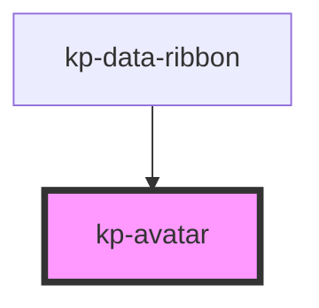

# kp-avatar

<!-- Auto Generated Below -->

## Properties

| Property    | Attribute    | Description | Type      | Default     |
| ----------- | ------------ | ----------- | --------- | ----------- |
| `alt`       | `alt`        |             | `string`  | `undefined` |
| `img`       | `img`        |             | `string`  | `undefined` |
| `isDefault` | `is-default` |             | `boolean` | `false`     |
| `isLarge`   | `is-large`   |             | `boolean` | `false`     |
| `isMedium`  | `is-medium`  |             | `boolean` | `false`     |
| `isSmall`   | `is-small`   |             | `boolean` | `false`     |
| `name`      | `name`       |             | `string`  | `undefined` |

## Dependencies

### Used by

 - [kp-data-ribbon](../kp-data-ribbon)

### Graph

----------------------------------------------

*Built with [StencilJS](https://stenciljs.com/)*
