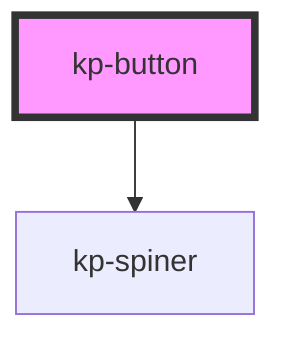

# kp-button

<!-- Auto Generated Below -->

## Properties

| Property          | Attribute           | Description | Type      | Default     |
| ----------------- | ------------------- | ----------- | --------- | ----------- |
| `buttonId`        | `button-id`         |             | `string`  | `undefined` |
| `buttonText`      | `button-text`       |             | `string`  | `undefined` |
| `isDefault`       | `is-default`        |             | `boolean` | `false`     |
| `isDisabled`      | `is-disabled`       |             | `boolean` | `false`     |
| `isInvert`        | `is-invert`         |             | `boolean` | `false`     |
| `isLarge`         | `is-large`          |             | `boolean` | `false`     |
| `isLoading`       | `is-loading`        |             | `boolean` | `false`     |
| `isLoadingIcon`   | `is-loading-icon`   |             | `boolean` | `false`     |
| `isOutline`       | `is-outline`        |             | `boolean` | `false`     |
| `isOutlineInvert` | `is-outline-invert` |             | `boolean` | `false`     |
| `isText`          | `is-text`           |             | `boolean` | `false`     |
| `useIcon`         | `use-icon`          |             | `boolean` | `false`     |

## Dependencies

### Depends on

- [kp-spiner](../kp-spiner)

### Graph

----------------------------------------------

*Built with [StencilJS](https://stenciljs.com/)*
