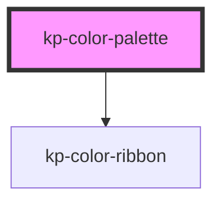

# kp-color-palette

<!-- Auto Generated Below -->

## Properties

| Property | Attribute | Description | Type  | Default     |
| -------- | --------- | ----------- | ----- | ----------- |
| `colors` | `colors`  |             | `any` | `undefined` |

## Dependencies

### Depends on

- [kp-color-ribbon](../kp-color-ribbon)

### Graph

----------------------------------------------

*Built with [StencilJS](https://stenciljs.com/)*
