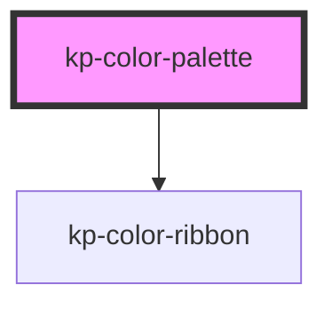

# kp-color-palette

<!-- Auto Generated Below -->

## Properties

| Property | Attribute | Description | Type                                                            | Default                                                                                                                                                                                                                                                                                                                                                     |
| -------- | --------- | ----------- | --------------------------------------------------------------- | ----------------------------------------------------------------------------------------------------------------------------------------------------------------------------------------------------------------------------------------------------------------------------------------------------------------------------------------------------------- |
| `colors` | --        |             | `{ hex: string; name: string; rgb: string; weight: string; }[]` | `[     {       hex: '#f3f4f6',       name: 'Sample Color ⚠️',       rgb: 'rgb(243, 244, 246)',       weight: 'SC500'     },     {       hex: '#000000',       name: 'Black ⚠️',       rgb: 'rgb(0, 0, 0)',       weight: 'B500'     },     {       hex: '#ffffff',       name: 'White ⚠️',       rgb: 'rgb(255, 255, 255)',       weight: 'W500'     }   ]` |

## Dependencies

### Depends on

- [kp-color-ribbon](../kp-color-ribbon)

### Graph

----------------------------------------------

*Built with [StencilJS](https://stenciljs.com/)*
