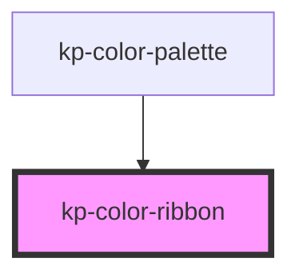

# kp-color-ribbon

<!-- Auto Generated Below -->

## Properties

| Property      | Attribute      | Description | Type      | Default                |
| ------------- | -------------- | ----------- | --------- | ---------------------- |
| `colorHex`    | `color-hex`    |             | `string`  | `'#f3f4f6'`            |
| `colorName`   | `color-name`   |             | `string`  | `'Sample Color ⚠️'`    |
| `colorRgb`    | `color-rgb`    |             | `string`  | `'rgb(243, 244, 246)'` |
| `colorWeight` | `color-weight` |             | `string`  | `'SC500'`              |
| `isCard`      | `is-card`      |             | `boolean` | `false`                |

## Dependencies

### Used by

 - [kp-color-palette](../kp-color-palette)

### Graph

----------------------------------------------

*Built with [StencilJS](https://stenciljs.com/)*
