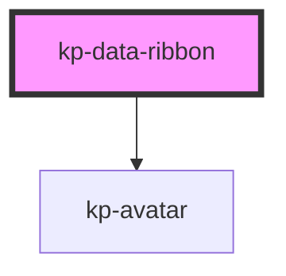

# kp-data-ribbon

<!-- Auto Generated Below -->

## Properties

| Property        | Attribute         | Description | Type     | Default     |
| --------------- | ----------------- | ----------- | -------- | ----------- |
| `dataAvatarUrl` | `data-avatar-url` |             | `string` | `undefined` |
| `dataHeading`   | `data-heading`    |             | `string` | `undefined` |

## Dependencies

### Depends on

- [kp-avatar](../kp-avatar)

### Graph

----------------------------------------------

*Built with [StencilJS](https://stenciljs.com/)*
